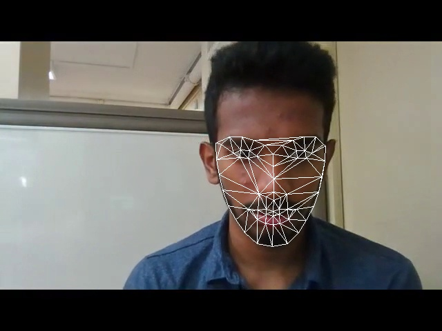

## FaceSwap 

The aim of this project is to implement an end-to-end pipeline to swap faces in a video just like Snapchat’s face swap filter. 


Steps include:
1) Facial Landmark detection
2) Delaunay Triangulation
3) Compute affine transform
4) Replace face
5) Poisson Blending

 <br/>
Triangular mesh from the fiducial landmarks via delaunay triangulation.<br/>


Source and target faces

Swapped face.

Sample outputs and the source images:


Required Packages 
```
Tested on dlib version 19.15
pip install dlib
```
* In case of failure check
```
 https://stackoverflow.com/questions/48306849/lib-x86-64-linux-gnu-libz-so-1-version-zlib-1-2-9-not-found
```

To run the code
```
cd FaceSwap
python Wrapper.py --sourceImage <source directory>  --targetImage<target image directory> --mode <Swap in same image (1) or different image (2) >
```	


